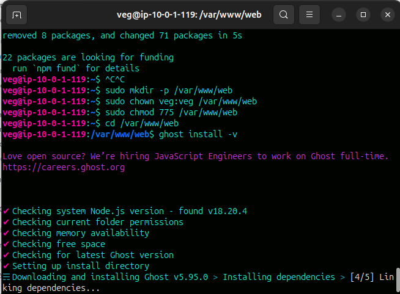
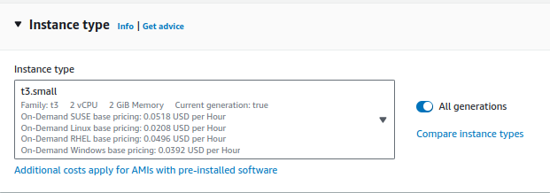
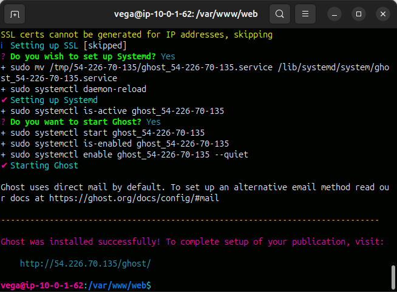
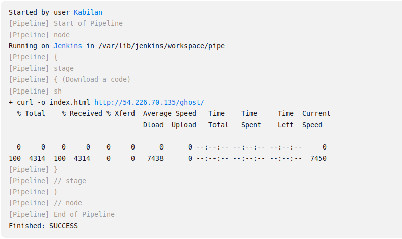
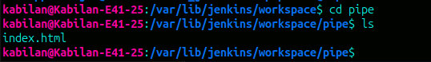

# Setup-a-ghost-web-then-download-a-home-page-as-a-html-using-jenkins-pipeline
# What is Ghost web ?
   Ghost is a powerful app for professional publishers to create, share, and grow a business around their content. It comes with modern tools to build a website, 
publish content, send newsletters &amp; offer paid subscriptions to members.

A full guide for installing, configuring and running Ghost on your Ubuntu 20.04 or 22.04 server, for use in production
### [How to install Ghost on Ubuntu official page](https://ghost.org/docs/install/ubuntu/)

### Create a new user and follow prompts
    sudo adduser <user>
    
### Add user to superuser group to unlock admin privileges
    sudo usermod -aG sudo <user>

### Then log in as the new user
    sudo su - <user>
    
### Update package lists
    sudo apt-get update

### Update installed packages
    sudo apt-get upgrade
    
### Install NGINX
    sudo apt-get install nginx
    
### If ufw was activated, the firewall allows HTTP and HTTPS connections. Open Firewall 80 and 443 port
    sudo ufw allow 'Nginx Full'
    
### Next, you’ll need to install MySQL to be used as the production database.
    sudo apt-get install mysql-server

### Enter mysql
    sudo mysql
### Update permissions
    ALTER USER 'root'@'localhost' IDENTIFIED WITH 'mysql_native_password' BY '<your-new-root-password>';
### Reread permissions
    FLUSH PRIVILEGES;
### exit mysql
    exit
    
### Install Node.js
### Download and import the Nodesource GPG key
    sudo apt-get update
    sudo apt-get install -y ca-certificates curl gnupg
    sudo mkdir -p /etc/apt/keyrings
    curl -fsSL https://deb.nodesource.com/gpgkey/nodesource-repo.gpg.key | sudo gpg --dearmor -o /etc/apt/keyrings/nodesource.gpg
    
    # Create deb repository
    NODE_MAJOR=18 # Use a supported version
    echo "deb [signed-by=/etc/apt/keyrings/nodesource.gpg] https://deb.nodesource.com/node_$NODE_MAJOR.x nodistro main" | sudo tee /etc/apt/sources.list.d/nodesource.list
    
    # Run update and install
    sudo apt-get update
    sudo apt-get install nodejs -y
    
### Install Ghost-CLI
Ghost-CLI is a commandline tool to help you get Ghost installed and configured for use, quickly and easily. The npm module can be installed with npm or yarn.

    sudo npm install ghost-cli@latest -g

### Create directory: Change `web` to whatever you like
    sudo mkdir -p /var/www/web

### Set directory owner: Replace <user> with the name of your user
    sudo chown <user>:<user> /var/www/web

### Set the correct permissions
    sudo chmod 775 /var/www/web

### Then navigate into it
    cd /var/www/web
    
### Install Ghost
### Run the install process
    ghost install
  
> [!IMPORTANT]
>  it hangs up here "Downloading and installing Ghost v5.72.1 > Linking dependencies > [4/5]

> [!TIP]
> I was used AWS EC2 t2.micro which is only 1 GB RAM. It is not enough.That's why I choosed t3.small it has 2GB RAM enough to run smoothly.

Finally, we successfully launched a ghost web page.

> [!TIP]
> Another option is create a swap memory for 2GB.

We can see if the system has any configured swap by typing.

    sudo swapon --show
    free -h
    
we’ll check our current disk usage to make sure we have enough space.

    sudo fallocate -l 2G /swapfile

We can verify that the correct amount of space was reserved by typing.

    ls -lh /swapfile

Enabling the Swap File.

    sudo chmod 600 /swapfile

Verify the permissions change by typing.

    ls -lh /swapfile

We can now mark the file as swap space.

    sudo mkswap /swapfile

After making the file, enable the swap file

    sudo swapon /swapfile
    
Make the swap file permenent.Back up the /etc/fstab file in case anything goes wrong.

    sudo cp /etc/fstab /etc/fstab.bak
    
Add the swap file information to the end of your /etc/fstab file by typing

    echo '/swapfile none swap sw 0 0' | sudo tee -a /etc/fstab

- Then, download a ghost web page using curl command on jenkins pipeline

- That code save on jenkins workspace
   
      sudo /var/lib/jenkins/workspace/

                     

